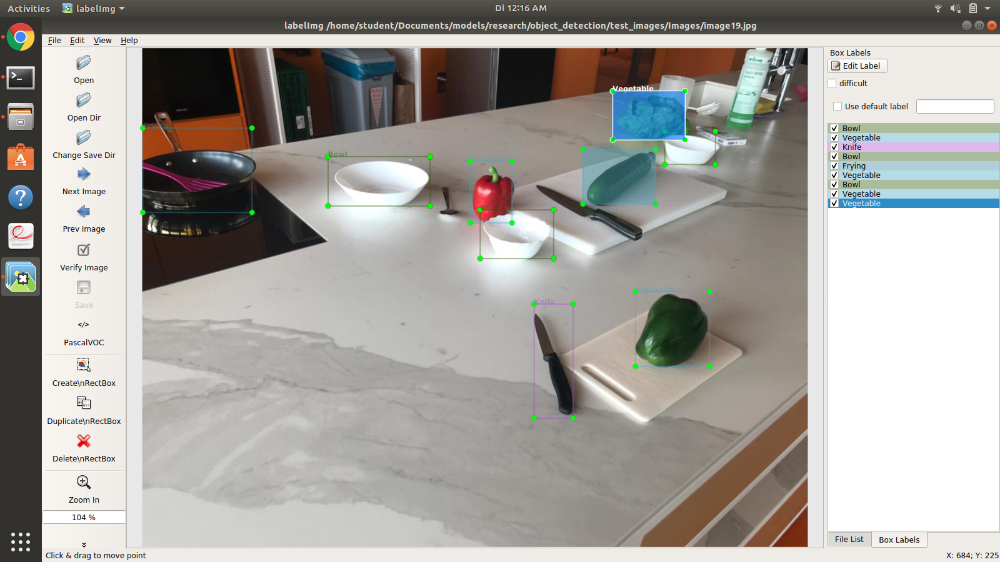

# Semi-Automated Bbox Annotation 
#### NOTE : Works after you have Working Tensorflow Object Detection API Model, add these scripts and replace "vis_util.py"
Additionally, you also need to adapt feature map depending on the classes you trained on.

This Repository contains extension of Tensorflow Object Detection API for semi-automated annotation.
The network of choice needs to be trained on desired classes.
Output is xml files for corresponding images.
Additional functionality of skipping updation of exiting xml annotation files with "verified flag".

